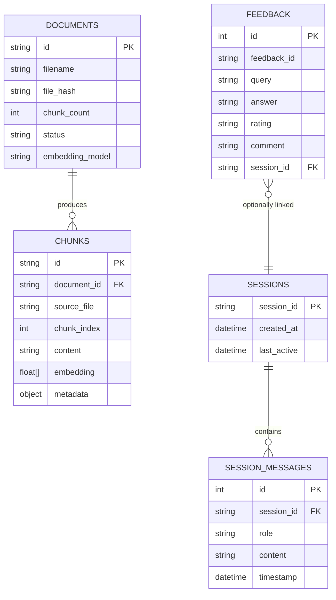

# DATABASE_DESIGN.md — Database & Storage Design
## RAG-Based Technical Documentation Assistant

**Version:** 1.0.0
**Date:** 2025-06-11

---

## Overview

The system uses three storage components:

| Component | Technology | Purpose |
|-----------|-----------|---------|
| Vector Store | ChromaDB (persistent) | Document chunks + embeddings |
| Document Registry | SQLite | Track ingested documents |
| Feedback Store | SQLite | User feedback on answers |
| Session Store (bonus) | In-memory dict | Conversation history |

All storage is local by design (prototype scope). Production migration paths are noted.

---

## Vector Store Schema

**Technology:** ChromaDB v0.5+ with persistent storage

ChromaDB organizes data into **collections**. We use a single collection: `technical_docs`.

### Collection Metadata

```python
collection = client.get_or_create_collection(
    name="technical_docs",
    metadata={
        "hnsw:space": "cosine",          # similarity metric
        "embedding_model": "all-MiniLM-L6-v2",  # must match at query time
        "created_at": "2025-06-11T10:00:00Z",
        "schema_version": "1.0",
    }
)
```

### Document (Chunk) Schema

Each entry in the ChromaDB collection represents one document chunk.

```
Field          Type              Description
───────────────────────────────────────────────────────
id             string            UUID, unique per chunk
                                 Format: "chunk_{doc_id}_{chunk_index}"
                                 Example: "chunk_doc001_003"

embedding      float32[]         Dense vector (dim=384 for MiniLM)

document       string            Raw text content of the chunk
                                 Max ~512 characters

metadata       object            See Metadata Schema below
```

### Metadata Schema

```python
{
    # Document identification
    "document_id":          str,   # "doc_001" — unique per ingested document
    "source_file":          str,   # "langchain_docs.md"
    "source_url":           str,   # "" if from file upload
    "document_title":       str,   # extracted from filename or <title> tag

    # Chunk position
    "chunk_index":          int,   # 0-based index within document
    "total_chunks":         int,   # total chunks produced from this document

    # Content info
    "char_count":           int,   # character length of chunk text
    "section_header":       str,   # nearest markdown header, if available

    # Provenance
    "ingestion_timestamp":  str,   # ISO8601 UTC
    "embedding_model":      str,   # model used to embed this chunk
    "file_hash":            str,   # SHA256 of original file content
}
```

### ChromaDB Query Interface

```python
# Similarity search
results = collection.query(
    query_embeddings=[query_vector],   # float32[]
    n_results=5,
    include=["documents", "metadatas", "distances"],
    where={"document_id": "doc_001"},   # optional metadata filter
)

# Returns:
{
    "ids": [["chunk_doc001_003", "chunk_doc002_011", ...]],
    "documents": [["chunk text 1", "chunk text 2", ...]],
    "metadatas": [[{...}, {...}, ...]],
    "distances": [[0.12, 0.18, ...]],  # cosine distances (lower = more similar)
}
```

---

## Document Registry Schema

**Technology:** SQLite via Python `sqlite3` or SQLAlchemy

### Table: `documents`

```sql
CREATE TABLE IF NOT EXISTS documents (
    id              TEXT PRIMARY KEY,          -- "doc_001"
    filename        TEXT NOT NULL,             -- "langchain_docs.md"
    source_url      TEXT DEFAULT '',           -- if ingested via URL
    file_hash       TEXT NOT NULL,             -- SHA256 of file content
    file_size_bytes INTEGER NOT NULL,
    file_type       TEXT NOT NULL,             -- "md", "txt", "html", "pdf"
    chunk_count     INTEGER NOT NULL,
    status          TEXT NOT NULL DEFAULT 'indexed',  -- indexed | failed | processing
    ingestion_timestamp TEXT NOT NULL,         -- ISO8601
    embedding_model TEXT NOT NULL,
    error_message   TEXT DEFAULT NULL,         -- populated if status = failed
    created_at      TEXT NOT NULL DEFAULT (datetime('now')),
    updated_at      TEXT NOT NULL DEFAULT (datetime('now'))
);

CREATE INDEX IF NOT EXISTS idx_documents_status ON documents(status);
CREATE INDEX IF NOT EXISTS idx_documents_file_hash ON documents(file_hash);
```

### Document Model (Python)

```python
from pydantic import BaseModel
from typing import Optional
from datetime import datetime

class DocumentRecord(BaseModel):
    id: str
    filename: str
    source_url: str = ""
    file_hash: str
    file_size_bytes: int
    file_type: str
    chunk_count: int
    status: str = "indexed"
    ingestion_timestamp: datetime
    embedding_model: str
    error_message: Optional[str] = None
```

---

## Feedback Schema

**Technology:** SQLite

### Table: `feedback`

```sql
CREATE TABLE IF NOT EXISTS feedback (
    id              INTEGER PRIMARY KEY AUTOINCREMENT,
    feedback_id     TEXT NOT NULL UNIQUE,           -- UUID
    query           TEXT NOT NULL,                  -- user's question
    answer          TEXT NOT NULL,                  -- system's answer
    rating          TEXT NOT NULL,                  -- "thumbs_up" | "thumbs_down"
    comment         TEXT DEFAULT NULL,              -- optional text comment
    sources_used    TEXT DEFAULT NULL,              -- JSON array of source filenames
    session_id      TEXT DEFAULT NULL,              -- if session tracking enabled
    query_type      TEXT DEFAULT NULL,              -- from query analysis
    retry_count     INTEGER DEFAULT 0,              -- retries needed for this query
    response_time_ms INTEGER DEFAULT NULL,          -- latency tracking
    created_at      TEXT NOT NULL DEFAULT (datetime('now'))
);

CREATE INDEX IF NOT EXISTS idx_feedback_rating ON feedback(rating);
CREATE INDEX IF NOT EXISTS idx_feedback_created ON feedback(created_at);
```

### Feedback Model (Python)

```python
class FeedbackRecord(BaseModel):
    feedback_id: str          # UUID
    query: str
    answer: str
    rating: Literal["thumbs_up", "thumbs_down"]
    comment: Optional[str] = None
    sources_used: Optional[List[str]] = None
    session_id: Optional[str] = None
    query_type: Optional[str] = None
    retry_count: int = 0
    response_time_ms: Optional[int] = None
```

---

## Session Schema (Bonus)

For conversation memory support.

### In-Memory Session Store (MVP)

```python
from typing import Dict, List
from datetime import datetime

class SessionStore:
    def __init__(self, ttl_seconds: int = 3600):
        self._sessions: Dict[str, SessionData] = {}
        self._ttl = ttl_seconds

    def get_history(self, session_id: str) -> List[dict]:
        session = self._sessions.get(session_id)
        if not session or self._is_expired(session):
            return []
        return session.history

    def append(self, session_id: str, role: str, content: str):
        if session_id not in self._sessions:
            self._sessions[session_id] = SessionData(
                session_id=session_id,
                history=[],
                created_at=datetime.utcnow(),
                last_active=datetime.utcnow(),
            )
        self._sessions[session_id].history.append({
            "role": role, "content": content, "timestamp": datetime.utcnow().isoformat()
        })
        self._sessions[session_id].last_active = datetime.utcnow()
```

### Persistent Session Schema (SQLite, for production)

```sql
CREATE TABLE IF NOT EXISTS sessions (
    session_id      TEXT PRIMARY KEY,
    created_at      TEXT NOT NULL,
    last_active     TEXT NOT NULL,
    message_count   INTEGER DEFAULT 0
);

CREATE TABLE IF NOT EXISTS session_messages (
    id          INTEGER PRIMARY KEY AUTOINCREMENT,
    session_id  TEXT NOT NULL REFERENCES sessions(session_id),
    role        TEXT NOT NULL,   -- "user" | "assistant"
    content     TEXT NOT NULL,
    timestamp   TEXT NOT NULL
);

CREATE INDEX IF NOT EXISTS idx_session_messages_session ON session_messages(session_id);
```

---

## Relationships



---

## Indexing Strategy

### ChromaDB (Vector Store)

ChromaDB uses HNSW (Hierarchical Navigable Small World) indexing by default.

- **HNSW parameters:** `M=16, ef_construction=200` (ChromaDB defaults)
- **Similarity metric:** Cosine similarity (`hnsw:space = "cosine"`)
- **Approximate vs exact:** HNSW is approximate — trades small accuracy loss for O(log n) search time vs O(n) exact search
- **No manual index management** — ChromaDB handles HNSW index automatically

### SQLite (Document Registry + Feedback)

```sql
-- Covers most common query patterns
CREATE INDEX idx_documents_status       ON documents(status);
CREATE INDEX idx_documents_file_hash    ON documents(file_hash);     -- dedup check
CREATE INDEX idx_feedback_rating        ON feedback(rating);         -- analytics
CREATE INDEX idx_feedback_created       ON feedback(created_at);     -- time range queries
CREATE INDEX idx_session_messages_sess  ON session_messages(session_id);
```

---

## Persistence Strategy

| Store | Persistence Method | Location | Notes |
|-------|-------------------|----------|-------|
| ChromaDB | PersistentClient (automatic) | `./chroma_db/` | Survives process restart |
| SQLite (registry) | File-based | `./data/registry.db` | Survives process restart |
| SQLite (feedback) | File-based | `./data/feedback.db` | Survives process restart |
| Session store | In-memory | RAM | Lost on restart |

**Startup behavior:**
- ChromaDB: `chromadb.PersistentClient(path=settings.CHROMA_PERSIST_DIR)` — creates directory if not exists
- SQLite: `CREATE TABLE IF NOT EXISTS` on startup — idempotent
- If ChromaDB directory is missing, system starts with empty corpus (valid state)
- If SQLite file is missing, tables are created fresh (valid state)

---

## Backup Strategy

### For MVP (Local Development)

```bash
# Backup ChromaDB
cp -r ./chroma_db ./backups/chroma_db_$(date +%Y%m%d_%H%M%S)

# Backup SQLite
sqlite3 ./data/registry.db ".backup './backups/registry_$(date +%Y%m%d).db'"
sqlite3 ./data/feedback.db  ".backup './backups/feedback_$(date +%Y%m%d).db'"
```

### For Production

| Component | Strategy |
|-----------|---------|
| ChromaDB | Migrate to managed vector DB (Pinecone, Weaviate) with built-in replication |
| SQLite | Migrate to PostgreSQL with daily pg_dump + S3 storage |
| Session store | Migrate to Redis with RDB persistence + AOF log |

**Document deduplication:** Before ingesting a new document, compute SHA256 of file content and check against `file_hash` in the registry. If match found, skip ingestion and return the existing document ID.

```python
async def check_duplicate(self, file_content: bytes) -> Optional[str]:
    file_hash = hashlib.sha256(file_content).hexdigest()
    result = await self.db.fetchone(
        "SELECT id FROM documents WHERE file_hash = ?", (file_hash,)
    )
    return result["id"] if result else None
```