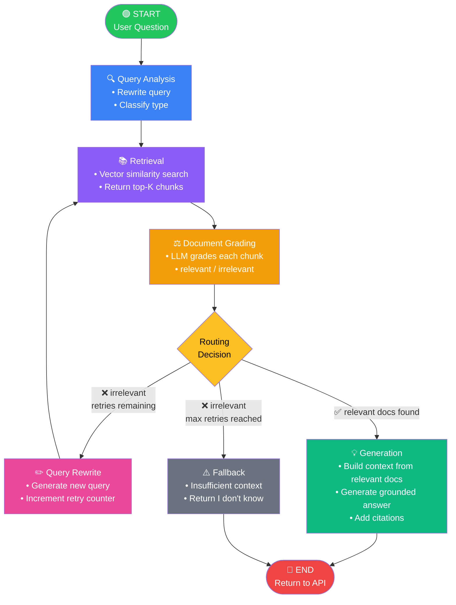

# LANGGRAPH_DESIGN.md — LangGraph Design Document
## RAG-Based Technical Documentation Assistant

**Version:** 1.0.0
**Date:** 2025-06-11

---

## StateGraph Architecture

The workflow is implemented as a `langgraph.graph.StateGraph` — a directed graph where each node is an async function that receives the full state, performs computation (often involving an LLM or vector store call), and returns a partial state update.

**Key principles:**
- State is the single source of truth flowing through all nodes
- Nodes are pure functions of state (no hidden side effects)
- Routing decisions are made by pure conditional edge functions
- The graph is compiled once at startup and reused across requests

---

## State Schema

```python
# app/workflow/state.py
from typing import TypedDict, List, Optional, Literal, Tuple
from pydantic import BaseModel

class DocumentChunk(BaseModel):
    content: str
    source_file: str
    document_id: str
    chunk_index: int
    distance: Optional[float] = None

class SourceReference(BaseModel):
    source_file: str
    document_id: str
    chunk_index: int
    excerpt: str  # first 100 chars of chunk

class GradedDoc(BaseModel):
    chunk: DocumentChunk
    grade: Literal["relevant", "irrelevant"]

class RAGState(TypedDict):
    # Input
    question: str                          # Original user question (immutable)
    session_id: Optional[str]             # For conversation memory (bonus)

    # Query Analysis
    rewritten_query: str                  # Current query for retrieval (mutable)
    query_type: Optional[str]            # conceptual | how-to | troubleshooting | api-reference

    # Retrieval
    retrieved_docs: List[DocumentChunk]  # Raw retrieval results
    top_k: int                           # Number of chunks to retrieve

    # Grading
    graded_docs: List[GradedDoc]         # All chunks with grades
    relevant_docs: List[DocumentChunk]   # Filtered relevant chunks only

    # Retry Logic
    retry_count: int                     # Number of rewrite+retrieve cycles done
    max_retries: int                     # Hard cap (default: 2)
    should_fallback: bool                # True when retries exhausted

    # Generation
    generation: Optional[str]           # Final answer text
    sources: List[SourceReference]      # Citations

    # Bonus: Hallucination Check
    hallucination_score: Optional[float]  # 0.0-1.0, 1.0 = fully supported
    hallucination_check_passed: Optional[bool]
```

**State initialization (at request time):**

```python
def create_initial_state(question: str, session_id: Optional[str] = None) -> RAGState:
    return RAGState(
        question=question,
        session_id=session_id,
        rewritten_query=question,   # starts as original question
        query_type=None,
        retrieved_docs=[],
        top_k=settings.TOP_K,
        graded_docs=[],
        relevant_docs=[],
        retry_count=0,
        max_retries=settings.MAX_RETRIES,
        should_fallback=False,
        generation=None,
        sources=[],
        hallucination_score=None,
        hallucination_check_passed=None,
    )
```

---

## Node Definitions

### Node 1: Query Analysis

**Purpose:** Transform the raw user question into a retrieval-optimized query. Classify the query type to allow downstream nodes to adapt their behavior.

**Input state fields used:** `question`

**Output state fields set:** `rewritten_query`, `query_type`

```python
# app/workflow/nodes/query_analysis.py

QUERY_ANALYSIS_PROMPT = """
You are a query analysis assistant for a technical documentation RAG system.

Given the user's question, perform two tasks:
1. Rewrite the query to improve retrieval from a vector store. Expand abbreviations,
   add relevant synonyms, and clarify ambiguous terms.
2. Classify the query type as one of:
   - conceptual: asking what something is or how it works
   - how-to: asking for step-by-step instructions
   - troubleshooting: asking about errors or unexpected behavior
   - api-reference: asking about specific function signatures, parameters, or return values

Respond ONLY in JSON format:
{{
  "rewritten_query": "<improved query>",
  "query_type": "<conceptual|how-to|troubleshooting|api-reference>"
}}

User question: {question}
"""

def query_analysis_node(llm: LLMClient):
    async def node(state: RAGState) -> dict:
        prompt = QUERY_ANALYSIS_PROMPT.format(question=state["question"])
        response = await llm.ainvoke([{"role": "user", "content": prompt}])

        try:
            parsed = json.loads(response)
            rewritten = parsed["rewritten_query"]
            query_type = parsed["query_type"]
        except (json.JSONDecodeError, KeyError):
            # Graceful fallback: use original question
            logger.warning("Query analysis parse failed, using original question")
            rewritten = state["question"]
            query_type = "conceptual"

        return {
            "rewritten_query": rewritten,
            "query_type": query_type,
        }
    return node
```

---

### Node 2: Retrieval

**Purpose:** Search the vector store for the top-K most semantically similar document chunks.

**Input state fields used:** `rewritten_query`, `top_k`

**Output state fields set:** `retrieved_docs`

```python
# app/workflow/nodes/retrieval.py

def retrieval_node(vector_store: VectorStoreBase):
    async def node(state: RAGState) -> dict:
        query = state["rewritten_query"]
        k = state.get("top_k", 5)

        try:
            docs = vector_store.similarity_search(query, k=k)
        except Exception as e:
            logger.error(f"Retrieval failed: {e}")
            docs = []

        logger.info(f"Retrieved {len(docs)} chunks for query: '{query[:80]}'")
        return {"retrieved_docs": docs}
    return node
```

---

### Node 3: Document Grading

**Purpose:** Evaluate each retrieved chunk for relevance to the original question. This is the self-corrective component.

**Input state fields used:** `question`, `retrieved_docs`

**Output state fields set:** `graded_docs`, `relevant_docs`

```python
# app/workflow/nodes/document_grading.py

GRADING_PROMPT = """
You are a relevance grader for a technical documentation assistant.

Your task: determine if the given document chunk is useful for answering the user's question.
Focus on topical relevance — the chunk doesn't need to answer the question completely.

Respond ONLY with valid JSON. No explanation. No markdown.
{{"grade": "relevant"}} or {{"grade": "irrelevant"}}

User question: {question}

Document chunk:
---
{chunk}
---
"""

def document_grading_node(llm: LLMClient):
    async def node(state: RAGState) -> dict:
        graded_docs = []
        relevant_docs = []

        for doc in state["retrieved_docs"]:
            prompt = GRADING_PROMPT.format(
                question=state["question"],
                chunk=doc.content[:1500]  # truncate to avoid token overflow
            )

            try:
                response = await llm.ainvoke([{"role": "user", "content": prompt}])
                parsed = json.loads(response.strip())
                grade = parsed.get("grade", "irrelevant")
                if grade not in ("relevant", "irrelevant"):
                    grade = "irrelevant"
            except (json.JSONDecodeError, Exception) as e:
                logger.warning(f"Grading parse error: {e}. Defaulting to irrelevant.")
                grade = "irrelevant"

            graded_docs.append(GradedDoc(chunk=doc, grade=grade))
            if grade == "relevant":
                relevant_docs.append(doc)

        logger.info(
            f"Grading complete: {len(relevant_docs)}/{len(state['retrieved_docs'])} relevant"
        )
        return {
            "graded_docs": graded_docs,
            "relevant_docs": relevant_docs,
        }
    return node
```

---

### Node 4: Generation

**Purpose:** Generate a final answer grounded in the relevant documents, with inline citations.

**Input state fields used:** `question`, `relevant_docs`, `should_fallback`

**Output state fields set:** `generation`, `sources`

```python
# app/workflow/nodes/generation.py

GENERATION_PROMPT = """
You are a precise technical documentation assistant.

Answer the user's question using ONLY the information provided in the context below.
- If the context contains the answer, provide it clearly and completely.
- After each factual claim, add a citation in the format: [Source: <filename>]
- If the context is insufficient, say: "The available documentation does not contain enough information to fully answer this question."
- Do not invent information not present in the context.

Context:
{context}

Question: {question}

Answer:
"""

FALLBACK_ANSWER = (
    "I was unable to find relevant information in the documentation corpus to answer your question. "
    "Please check that your question is related to the indexed documents, or consider rephrasing it."
)

def generation_node(llm: LLMClient):
    async def node(state: RAGState) -> dict:
        if state.get("should_fallback", False):
            return {
                "generation": FALLBACK_ANSWER,
                "sources": [],
            }

        context_parts = []
        for i, doc in enumerate(state["relevant_docs"]):
            context_parts.append(
                f"[Source: {doc.source_file}, chunk {doc.chunk_index}]\n{doc.content}"
            )
        context = "\n\n---\n\n".join(context_parts)

        prompt = GENERATION_PROMPT.format(
            context=context,
            question=state["question"]
        )

        answer = await llm.ainvoke([{"role": "user", "content": prompt}])
        sources = [
            SourceReference(
                source_file=doc.source_file,
                document_id=doc.document_id,
                chunk_index=doc.chunk_index,
                excerpt=doc.content[:100],
            )
            for doc in state["relevant_docs"]
        ]

        return {"generation": answer, "sources": sources}
    return node
```

---

### Additional Node: Query Rewrite

**Purpose:** Generate an alternative query when all retrieved documents are irrelevant.

**Input state fields used:** `question`, `rewritten_query`, `retry_count`

**Output state fields set:** `rewritten_query`, `retry_count`

```python
REWRITE_PROMPT = """
You are a query rewriting assistant for a RAG system.

The following query failed to retrieve relevant documents from a technical documentation corpus.
Generate an improved version that:
- Uses different terminology or synonyms
- Is more specific or more general as appropriate
- Focuses on the core intent of the original question

Respond with ONLY the rewritten query as plain text.

Original question: {question}
Failed query (attempt {retry_count}): {rewritten_query}
"""

def query_rewrite_node(llm: LLMClient):
    async def node(state: RAGState) -> dict:
        prompt = REWRITE_PROMPT.format(
            question=state["question"],
            rewritten_query=state["rewritten_query"],
            retry_count=state["retry_count"],
        )
        new_query = await llm.ainvoke([{"role": "user", "content": prompt}])
        new_count = state["retry_count"] + 1

        logger.info(f"Query rewrite attempt {new_count}: '{new_query.strip()[:80]}'")
        return {
            "rewritten_query": new_query.strip(),
            "retry_count": new_count,
        }
    return node
```

---

### Additional Node: Hallucination Check (Bonus)

**Purpose:** Verify the generated answer is supported by the retrieved context (Self-RAG inspired).

**Input state fields used:** `question`, `generation`, `relevant_docs`

**Output state fields set:** `hallucination_score`, `hallucination_check_passed`

```python
HALLUCINATION_PROMPT = """
You are a factual grounding checker.

Given an answer and the source context it was generated from, determine whether
every factual claim in the answer is supported by the context.

Respond ONLY with JSON:
{{"score": <0.0 to 1.0>, "supported": <true|false>, "unsupported_claims": [<list of strings>]}}

A score of 1.0 means fully supported. Below 0.7 should be flagged.

Context:
{context}

Answer:
{answer}
"""

def hallucination_check_node(llm: LLMClient):
    async def node(state: RAGState) -> dict:
        context = "\n\n".join(doc.content for doc in state["relevant_docs"])
        prompt = HALLUCINATION_PROMPT.format(
            context=context[:3000],
            answer=state["generation"]
        )
        response = await llm.ainvoke([{"role": "user", "content": prompt}])
        try:
            parsed = json.loads(response)
            score = float(parsed.get("score", 0.5))
            passed = parsed.get("supported", score >= 0.7)
        except Exception:
            score = 0.5
            passed = True  # Don't block on parse error

        return {
            "hallucination_score": score,
            "hallucination_check_passed": passed,
        }
    return node
```

---

## Edge Definitions

| From | To | Type | Condition |
|------|-----|------|-----------|
| `query_analysis` | `retrieval` | Fixed | Always |
| `retrieval` | `document_grading` | Fixed | Always |
| `document_grading` | `generation` | Conditional | `relevant_docs` found OR `should_fallback == True` |
| `document_grading` | `query_rewrite` | Conditional | No relevant docs AND retry count < max |
| `query_rewrite` | `retrieval` | Fixed | Always (loop back) |
| `generation` | `END` | Fixed | Always |

---

## Conditional Routing

```python
# app/workflow/routing.py

def route_after_grading(state: RAGState) -> str:
    """
    Core routing logic after document grading.

    Returns:
        "generate"  — proceed to generation with relevant docs
        "rewrite"   — retry with rewritten query
        "fallback"  — max retries reached, generate fallback answer
    """
    has_relevant = len(state["relevant_docs"]) > 0
    retries_remaining = state["retry_count"] < state["max_retries"]

    if has_relevant:
        return "generate"
    elif retries_remaining:
        return "rewrite"
    else:
        # Update fallback flag — generation node will use this
        # Note: LangGraph handles state mutation per node; we signal via routing key
        return "fallback"

def route_after_hallucination_check(state: RAGState) -> str:
    """Bonus: route after hallucination check."""
    if state.get("hallucination_check_passed", True):
        return "end"
    else:
        return "regenerate"  # Optional: loop back to generation with stronger grounding prompt
```

**Important:** When routing to "fallback", the generation node must read `should_fallback` from state. Since LangGraph conditional edges don't directly mutate state, the convention is to set `should_fallback = True` in the grading node when retries are exhausted, and check it in the routing function as well.

A cleaner alternative is to add a dedicated `fallback_node` as the target for the "fallback" route:

```python
graph.add_conditional_edges(
    "document_grading",
    route_after_grading,
    {
        "generate": "generation",
        "rewrite": "query_rewrite",
        "fallback": "generation",  # generation handles fallback via state flag
    }
)
```

---

## Retry Logic

The retry mechanism is implemented as a loop in the graph:

```
document_grading → [no relevant] → query_rewrite → retrieval → document_grading → ...
```

The retry counter is incremented in `query_rewrite_node`. The routing function checks `retry_count < max_retries` before routing to `query_rewrite`.

**Termination guarantee:** The loop terminates because:
1. `retry_count` is strictly monotonically increasing
2. `max_retries` is a fixed positive integer
3. When `retry_count >= max_retries`, the routing function always returns `"fallback"` instead of `"rewrite"`

**Example trace:**
```
retry_count=0, max_retries=2 → grading fails → route: "rewrite" → retry_count becomes 1
retry_count=1, max_retries=2 → grading fails → route: "rewrite" → retry_count becomes 2
retry_count=2, max_retries=2 → grading fails → route: "fallback" → generation (fallback)
```

---

## Failure Recovery

| Failure | Recovery Strategy |
|---------|------------------|
| LLM timeout in grading node | Default all pending chunks to "irrelevant" |
| LLM timeout in generation node | Return 503 with retry-after header |
| Empty retrieval (k=0 results) | Treat as all-irrelevant, trigger retry |
| Query rewrite returns empty string | Fall back to original question |
| State becomes inconsistent | LangGraph checkpointer (future) allows resume |

---

## Graph Lifecycle

```python
# app/main.py

from fastapi import FastAPI
from app.workflow.graph import build_rag_graph
from app.infrastructure.vector_store import ChromaVectorStore
from app.infrastructure.llm_client import LLMClient
from app.config import settings

app = FastAPI(title="RAG Documentation Assistant")

rag_graph = None  # compiled graph, initialized at startup

@app.on_event("startup")
async def startup_event():
    global rag_graph
    vector_store = ChromaVectorStore(settings.CHROMA_PERSIST_DIR)
    llm_client = LLMClient(settings.LLM_PROVIDER, settings.LLM_MODEL)
    rag_graph = build_rag_graph(vector_store, llm_client)
    logger.info("RAG graph compiled and ready")

@app.on_event("shutdown")
async def shutdown_event():
    # ChromaDB handles its own cleanup
    logger.info("Shutting down")
```

---

## Mermaid Workflow Diagram



---

## Complete Graph Build Code

```python
# app/workflow/graph.py

from langgraph.graph import StateGraph, END
from app.workflow.state import RAGState
from app.workflow.nodes.query_analysis import query_analysis_node
from app.workflow.nodes.retrieval import retrieval_node
from app.workflow.nodes.document_grading import document_grading_node
from app.workflow.nodes.generation import generation_node
from app.workflow.nodes.query_rewrite import query_rewrite_node
from app.workflow.routing import route_after_grading

def build_rag_graph(vector_store, llm_client, include_hallucination_check=False):
    graph = StateGraph(RAGState)

    # Register nodes
    graph.add_node("query_analysis", query_analysis_node(llm_client))
    graph.add_node("retrieval", retrieval_node(vector_store))
    graph.add_node("document_grading", document_grading_node(llm_client))
    graph.add_node("generation", generation_node(llm_client))
    graph.add_node("query_rewrite", query_rewrite_node(llm_client))

    if include_hallucination_check:
        from app.workflow.nodes.hallucination_check import hallucination_check_node
        graph.add_node("hallucination_check", hallucination_check_node(llm_client))

    # Entry point
    graph.set_entry_point("query_analysis")

    # Fixed edges
    graph.add_edge("query_analysis", "retrieval")
    graph.add_edge("retrieval", "document_grading")
    graph.add_edge("query_rewrite", "retrieval")  # retry loop

    # Conditional edge after grading
    graph.add_conditional_edges(
        "document_grading",
        route_after_grading,
        {
            "generate": "generation",
            "rewrite": "query_rewrite",
            "fallback": "generation",
        }
    )

    # Terminal edge
    if include_hallucination_check:
        graph.add_edge("generation", "hallucination_check")
        graph.add_edge("hallucination_check", END)
    else:
        graph.add_edge("generation", END)

    return graph.compile()
```