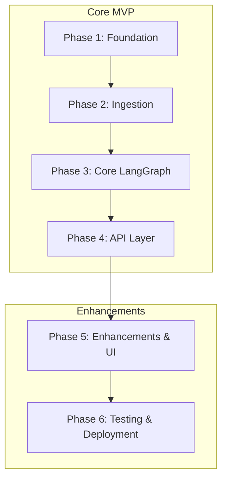

# MASTER_PLAN.md — Master Delivery Plan
## RAG-Based Technical Documentation Assistant

**Role:** Principal AI Architect, Staff Software Engineer, Technical Program Manager, and Enterprise Delivery Lead
**Version:** 1.1.0
**Date:** 2026-06-11
**Target Stack:** Python 3.11, FastAPI, LangGraph, ChromaDB, local sentence-transformers
**LLM Providers**: Groq & Gemini ONLY

---

## 1. Project Summary

This project implements a Retrieval-Augmented Generation (RAG) system with a self-corrective LangGraph workflow that answers natural language questions about a technical documentation corpus. The implementation is split into a **Core MVP** (Phases 1–4) satisfying all mandatory assignment requirements, followed by **Enhancements** (Phases 5–6) covering Hallucination Verification, Streamlit UI, Testing, and Deployment.

---

## 2. Architecture Summary

The system is a local Python monolith built using a layered architecture:
1. **API Presentation Layer (FastAPI)**: Routes requests, validates schemas, handles CORS, and intercepts exceptions.
2. **Service Layer (Query, Ingestion, Feedback)**: Orchestrates the execution of business processes.
3. **Domain Layer (LangGraph StateGraph)**: Coordinates query analysis, vector retrieval, document relevance grading, query rewriting retry loop, and answer generation.
4. **Infrastructure Layer (Vector Store, Embeddings, LLM, Loaders)**: Adapts external APIs and libraries (ChromaDB, sentence-transformers, Groq/Gemini client, etc.) to the domain abstractions.
5. **Storage Layer**: SQLite for document registry and feedback persistence, and persistent ChromaDB on local disk for vectors.

### LangGraph Workflow (Core MVP vs. Enhancements)

In the Core MVP, the graph runs:
```
Query Analysis ➔ Retrieval ➔ Document Grading ➔ Generation/Fallback ➔ END
```
In the Enhancements phase, the workflow is extended to:
```
Generation ➔ Hallucination Check ➔ Answer/END
```

---

## 3. Phase Dependency Diagram



---

## 4. Execution Order & Timeline

| Phase | Phase Name | Focus | Scope Boundary | Estimated Effort |
|---|---|---|---|---|
| **Phase 1** | Foundation | Project structure, settings config, logging, exceptions, SQLite database setup | **Core MVP** | 2-4 Hours |
| **Phase 2** | Ingestion | Text splitter, file/URL loaders, ChromaDB integration, CLI seed scripts | **Core MVP** | 3-6 Hours |
| **Phase 3** | Core LangGraph | State definitions, Core nodes (Query Analysis, Retrieval, Grading, Generation, Query Rewrite) | **Core MVP** | 4-6 Hours |
| **Phase 4** | API Layer | FastAPI routes (`/query`, `/ingest`, `/documents`, `/feedback`), validation | **Core MVP** | 3-5 Hours |
| **Phase 5** | Enhancements | **Hallucination Verification** node integration, Streamlit Q&A UI | **Enhancements** | 3-5 Hours |
| **Phase 6** | Testing & Deployment | Unit/integration testing suite, Dockerfile, Compose, CI GitHub Actions | **Enhancements** | 3-5 Hours |

---

## 5. Risk Register

| Risk ID | Risk Description | Likelihood | Impact | Mitigation Strategy |
|---|---|---|---|---|
| **R-01** | LLM API rate limits or network timeout | Medium | High | Use async handlers, implement retry logic with exponential backoff. |
| **R-02** | LLM outputs malformed JSON for grading | Medium | High | Use robust JSON parsing block in grading and rewrite nodes with safe default fallbacks. |
| **R-03** | Infinite retry loop in LangGraph | Low | High | Hard-cap the retry counter in the routing functions and assert termination guarantees. |

---

## 6. Critical Path (MVP Only)

```text
Requirements Setup (1.2) -> SQLite Factory (1.6) -> Chroma Adapter (2.2) -> Text Splitter (2.5) -> Ingest CLI (2.7) 
-> LLM Adapter (3.2) -> Document Grading Node (3.4) -> Core Graph Build (3.8) -> /query API route (4.2)
```

---

## 7. Go/No-Go Criteria (MVP Only)

*   **Go Criteria**:
  - Code compiles without warnings/errors.
  - Core API response latency is within standard limits.
  - Graph does not loop infinitely on irrelevant questions.
*   **No-Go Criteria**:
  - API secrets are committed to Git.
  - Naive RAG is used without document grading / self-corrective loops.

---

## 8. Final Production Readiness Checklist

- [ ] Environment variable validation loaded securely through Pydantic BaseSettings.
- [ ] No API keys hardcoded in any modules.
- [ ] SQLite tables created idempotently at application startup.
- [ ] ChromaDB directory set to persist locally to `./chroma_db`.
- [ ] LLM communication restricted to Groq and Google Gemini ONLY.
- [ ] Hard retry limits enforced inside LangGraph workflow.
- [ ] FastAPI `/query` endpoint correctly records answer feedback to SQLite.
