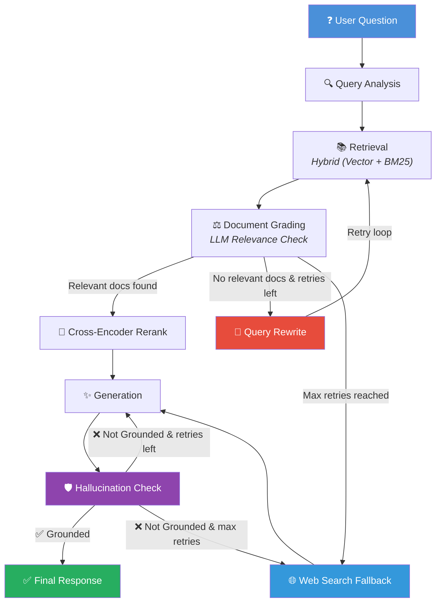

# Self-Corrective RAG Documentation Assistant
### Express Analytics AI/ML Engineer Intern Take-Home Assignment Submission

A production-grade, self-correcting Retrieval-Augmented Generation (RAG) assistant built using **FastAPI**, **LangGraph**, **ChromaDB**, and **Gemini/Groq LLMs**. Designed to answer complex technical questions over document corpora with zero hallucinations.

---

### 🌐 Live Deployment
This application is fully containerized and deployed on **Hugging Face Spaces**!
- **Live Streamlit App:** [RAG Documentation Assistant on Hugging Face Spaces](https://huggingface.co/spaces/aimprabu/RAG_Documentation_Assistant)

---

## 🧞 Project Overview

### What Problem This Solves
Technical documentation is dense, constantly updated, and contains complex relationships (API endpoints, parameters, configuration blocks). Standard LLMs lack this local context and frequently hallucinate answers. Traditional RAG systems retrieve documents but do not evaluate their relevance, leading to noisy contexts and incorrect generations. 

This project solves this by wrapping document retrieval in a **self-correcting agentic loop** that analyzes queries, grades retrieval relevance, rewrites queries dynamically, falls back to web search if the corpus lacks answers, and verifies that responses are grounded in the retrieved facts to prevent hallucinations.

### Why RAG Was Chosen
Fine-tuning an LLM on proprietary codebases is computationally expensive, requires continuous training as documentation updates, and does not support precise document citations. RAG separates the model's reasoning capabilities from its knowledge base, allowing real-time index updates and auditability via direct source citations.

### Why LangGraph Was Chosen
Standard LangChain Expression Language (LCEL) pipelines are directed acyclic graphs (DAGs). They cannot easily express iterative operations or cycles. Our self-correcting RAG architecture requires retry loops: if document grading finds all chunks irrelevant, the query is rewritten and retrieval is re-executed. LangGraph's StateGraph provides native support for cycles, state management, and routing decisions.

---

## 🏗️ Architecture



### System Components

| Component | Technology | Purpose |
|---|---|---|
| **API Layer** | FastAPI | High-performance REST API endpoints, schema validation, and logging |
| **Workflow Engine** | LangGraph StateGraph | Orchestrates agentic loops and conditional routing |
| **Vector Store** | ChromaDB | Persistent vector storage, metadata filtering, and semantic search |
| **Keyword Search** | rank_bm25 | Python BM25 implementation for lexical candidate matching |
| **Reranker** | sentence-transformers | MS-MARCO Cross-Encoder model for query-document re-ranking |
| **Embeddings** | all-MiniLM-L6-v2 | Local embedding model (384-dimensional dense vectors) |
| **Relational DB** | SQLite | Session chat history, document catalog registry, and user feedback |
| **UI Panel** | Streamlit | Dark-themed user dashboard, auto-uploader, and debug panel |

---

## 🔄 LangGraph Workflow

The StateGraph coordinates data flow through the following nodes:

1. **Query Analysis:** Analyzes user query, classifies it (conversational, conceptual, coding), and extracts key search terms.
2. **Retrieval:** Performs hybrid retrieval (Vector search + BM25 keyword search) from ChromaDB.
3. **Document Grading:** LLM checks whether retrieved chunks are relevant to the query. Irrelevant chunks are discarded.
4. **Query Rewrite:** If zero relevant chunks are found, the LLM reformulates the query to optimize keyword matching.
5. **Web Search:** After exhausting database retries, queries the web via DuckDuckGo and formats pages as temporary chunks.
6. **Generation:** Synthesizes a detailed answer using only relevant document chunks.
7. **Hallucination Check:** Evaluates answer factuality. If the answer contains facts not present in the chunks, it is rejected and sent back to Generation.

---

## 📊 State Schema

The LangGraph workflow maintains state using the `RAGState` TypedDict:

* `question` (str): Original user question.
* `rewritten_query` (str): Rewritten search query for database lookup.
* `query_type` (str): Classified query intent (conversational, conceptual, coding).
* `retrieved_docs` (list[DocumentChunk]): Candidate chunks returned by retrieval.
* `relevant_docs` (list[DocumentChunk]): Chunks graded as relevant by the grader.
* `generation` (str): Answer synthesized by the generator node.
* `sources` (list[SourceReference]): Citations used in the answer.
* `retry_count` (int): Number of database retrieval rewrite attempts.
* `max_retries` (int): Maximum number of database retries allowed.
* `should_fallback` (bool): Flag indicating if web search fallback should be used.
* `hallucination_score` (float): Grounding score (0.0 to 1.0) of the response.
* `hallucination_check_passed` (bool): Grounding verification verdict.
* `regeneration_count` (int): Count of regeneration attempts following grounding failures.

---

## 📦 Document Ingestion Pipeline

Ingestion handles new files in four structured stages:

```
[File Upload] -> [File Loaders] -> [Header-Aware Chunker] -> [Local Embeddings] -> [ChromaDB + SQLite]
```

1. **Document Loading:** Custom loaders parse `.md`, `.pdf`, `.txt`, and `.html` files.
2. **Header-Aware Chunking:** Rewrites raw text into semantic units. Rather than slicing at arbitrary lengths (which breaks tables and code blocks), the chunker splits along Markdown headers (`#` to `######`) and horizontal rules (`---`). Parent header hierarchies are prepended to each sub-chunk to preserve context.
3. **Embedding Generation:** Dense 384-dimensional embeddings are generated locally using `sentence-transformers/all-MiniLM-L6-v2`.
4. **Vector Storage & Cataloging:** Embeddings and chunks are written to persistent ChromaDB storage. Metadata (filename, size, hash) is registered in SQLite to support duplicate checking via SHA-256.

---

## 🌐 API Documentation

### `POST /query`
- **Purpose:** Submit user questions to the self-correcting RAG workflow.
- **Request Body:**
  ```json
  {
    "question": "What is FastAPI?",
    "session_id": "93665248-1234-5678-1234-567812345678",
    "top_k": 5,
    "max_retries": 2,
    "filter_filenames": ["fastapi_docs.md"]
  }
  ```
- **Response Example (200 OK):**
  ```json
  {
    "answer": "FastAPI is a modern web framework...",
    "sources": [
      {
        "source_file": "fastapi_docs.md",
        "document_id": "doc_9bdca13",
        "chunk_index": 2,
        "excerpt": "FastAPI is a modern, fast..."
      }
    ],
    "confidence_score": 0.95,
    "debug_trace": { ... }
  }
  ```

### `POST /ingest`
- **Purpose:** Ingest, chunk, embed, and index a file or web URL.
- **Request (Multipart Form):**
  - `file` (UploadFile, Optional): The local document file.
  - `url` (str, Optional): Remote HTML URL to scrap.
- **Response Example (201 Created):**
  ```json
  {
    "document_id": "doc_9bdca13",
    "filename": "fastapi_docs.md",
    "chunks_indexed": 23,
    "status": "indexed",
    "message": "Document successfully indexed."
  }
  ```

### `GET /documents`
- **Purpose:** Retrieve lists of all indexed documents in the database.
- **Response Example (200 OK):**
  ```json
  {
    "documents": [
      {
        "id": "doc_9bdca13",
        "filename": "fastapi_docs.md",
        "chunk_count": 23,
        "status": "indexed"
      }
    ]
  }
  ```

### `DELETE /documents/{id}`
- **Purpose:** Permanently remove document vectors and metadata.
- **Response Example (200 OK):**
  ```json
  {
    "message": "Successfully deleted document doc_9bdca13 and 23 chunks."
  }
  ```

### `POST /feedback`
- **Purpose:** Log thumbs-up or thumbs-down answer reviews.
- **Request:**
  ```json
  {
    "question": "What is FastAPI?",
    "answer": "FastAPI is a...",
    "feedback_type": "positive"
  }
  ```

### `GET /health`
- **Purpose:** Standard health check.
- **Response:** `{"status": "healthy", ...}`

### `GET /metrics`
- **Purpose:** Exposes statistics for dashboard logs.

---

## ✨ Bonus Features Implemented

* **✅ Hallucination Detection:** Generates responses, grades their grounding value against source chunks, and automatically triggers query rewrites or answer regenerations in case of hallucination.
* **✅ Web Search Fallback:** Falls back to DuckDuckGo/Tavily search when local vector retrieval fails to find relevant information.
* **✅ Conversation Memory:** Maintains multi-turn conversation logs in SQLite. Subsequent prompts are augmented with chat contexts to resolve pronouns and follow-ups.
* **✅ Streamlit UI:** Includes a premium dark-themed interface, drag-and-drop document uploaders, dynamic checklist indicators, collapsible source expanders, and complete debugging traces.

---

## 🏗️ Detailed System Design & Component Reasoning

### 1. Thought Process & Architecture Reasoning

#### Why This Architecture Was Chosen
I designed this Retrieve-Augmented Generation (RAG) assistant to solve the problem of information fragmentation and hallucinations when querying dense technical documentation. A standard RAG pipeline (retrieve once, generate once) is highly fragile: it assumes the database will always return relevant chunks on the first try and that the LLM will always generate a factual answer based solely on that context. 

To build a production-grade system, I implemented a **self-corrective agentic loop** that evaluates the quality of retrieval and generation at every step. This architecture ensures that:
- Queries are refined before retrieval.
- Irrelevant content is discarded before generation.
- Hallucinations are actively detected and corrected.
- The system gracefully falls back to web search when the local corpus is insufficient.

#### Why Specific Technologies Were Selected
- **FastAPI:** Exposes the API endpoints. It was selected for its high performance, native support for async execution, automated OpenAPI documentation generation, and integration with Pydantic for strict request/response data contract validation.
- **SQLite:** Acts as a lightweight relational store. It was chosen to handle conversation history, feedback logs, and document catalog indices without requiring the overhead of a separately managed database server.
- **ChromaDB:** A persistent vector store that runs embedded in the Python process. It provides low-latency vector indexing and metadata filtering without cloud dependencies.
- **sentence-transformers:** Used for offline feature extraction. By running the embedding model and reranker locally, I eliminated external API call latency and network transfer costs.

#### Why LangGraph Was Used Instead of a Simple Pipeline
Traditional pipelines (built using standard LangChain Expression Language / LCEL) model data flow as a Directed Acyclic Graph (DAG). They cannot easily express feedback loops or conditional retries. Our self-correcting RAG architecture requires cyclical control flow:
1. If the retrieved documents fail grading, we must rewrite the query and loop back to the retrieval node.
2. If the generated response fails the hallucination check, we must regenerate the answer from the context.

LangGraph's `StateGraph` provides a native runtime for state management, cyclical routing, and node execution, making it the ideal framework to orchestrate these complex logic branches.

#### How the Workflow Was Designed
The graph is designed as a state machine where a shared dictionary-like structure (`RAGState` in `app/workflow/state.py`) carries state parameters across the execution cycle:
- **`query_analysis`** is the entry point, classifying the question type and optimizing the search query.
- If classified as `"conversational"`, the workflow routes directly to **`generation`** to prevent unnecessary vector queries.
- Otherwise, the state moves to **`retrieval`** and immediately proceeds to **`document_grading`**.
- Based on grading results, a conditional edge routes the state to **`generation`** (if relevant chunks exist), **`query_rewrite`** (if no relevant chunks exist and retries remain), or **`web_search`** (if retries are exhausted).
- From **`generation`**, the workflow transitions to **`hallucination_check`**, which conditionally routes to **`generation`** for regeneration (if ungrounded and retries remain) or terminates at `END`.

---

### 2. Workflow Component Reasoning

#### Query Analysis
- **Problem Solved:** Technical questions are often conversational, poorly formatted, or include ambiguous acronyms.
- **Why It Exists:** I implemented the query analysis node (`query_analysis_node` in `app/workflow/nodes/query_analysis.py`) to classify user intent and formulate search-optimized queries.
- **Interactions:** Uses the `QUERY_ANALYSIS_PROMPT` to analyze the query. It outputs a `rewritten_query` and a `query_type` (e.g., `api-reference`, `how-to`, `conversational`). The routing function `route_after_analysis` uses `query_type` to bypass retrieval if the intent is purely casual conversational greeting/chit-chat.

#### Retrieval
- **Problem Solved:** Chunks must be fetched from the database using search parameters.
- **Why It Exists:** The retrieval node (`retrieval_node` in `app/workflow/nodes/retrieval.py`) queries the index.
- **Interactions:** It consumes `rewritten_query` and `filter_filenames` (used to restrict search scope to a specific file, preventing cross-document noise). It calls the database layer and saves results to `retrieved_docs`.

#### Hybrid Search
- **Problem Solved:** Dense vector searches excel at semantic concepts but often miss exact keyword matches (e.g., specific variable names, error codes, or CLI parameters).
- **Why It Exists:** I implemented a custom `HybridVectorStore` (in `app/infrastructure/vector_store/hybrid_store.py`) that wraps the ChromaDB client with a local lexical search engine.
- **Interactions:** It queries the vector store via cosine similarity and concurrently runs a keyword search using the `rank_bm25` library's `BM25Okapi` algorithm. Results are combined and re-ranked using **Reciprocal Rank Fusion (RRF)** with a standard rank constant of `60.0` to return the top `k` most relevant candidate chunks.

#### Document Grading
- **Problem Solved:** Dense vector retrieval can return chunks that are semantically close but contain no actual answer facts.
- **Why It Exists:** The document grading node (`document_grading_node` in `app/workflow/nodes/document_grading.py`) acts as a quality gate.
- **Interactions:** Evaluates retrieved chunks against the question using the LLM with `GRADING_PROMPT` (or `BATCH_GRADING_PROMPT` for batch execution). It filters out irrelevant chunks and registers relevant ones in `relevant_docs`.

#### Query Rewrite
- **Problem Solved:** When retrieval returns zero relevant documents, it is typically because the query lacks the correct terms or synonyms.
- **Why It Exists:** The query rewrite node (`query_rewrite_node` in `app/workflow/nodes/query_rewrite.py`) reformulates the query.
- **Interactions:** Uses the `REWRITE_PROMPT` to generate a new search string, increments `retry_count`, and routes back to the `retrieval` node to restart the search cycle.

#### Cross-Encoder Reranking
- **Problem Solved:** Bi-encoder models (used for initial vector retrieval) process queries and documents independently, which can limit search precision.
- **Why It Exists:** I implemented a reranking step within the retrieval pipeline using `CrossEncoderReranker` (in `app/infrastructure/reranker/cross_encoder.py`).
- **Interactions:** It runs the local `cross-encoder/ms-marco-MiniLM-L-6-v2` transformer model over retrieved candidates, jointly scoring each query-document pair. This re-orders the chunks to place the highest-quality segments at the top of the context block.

#### Generation
- **Problem Solved:** Answers must be synthesized from context while adhering to specific tones and citation rules.
- **Why It Exists:** The generation node (`generation_node` in `app/workflow/nodes/generation.py`) produces the final text response.
- **Interactions:** Reads `relevant_docs` and formats them into a context block. It queries the LLM using the `GENERATION_PROMPT`, instructing it to structure the output according to the query type (e.g., Markdown tables for comparisons, step-by-step numbers for how-tos) and cite source documents inline.

#### Hallucination Check
- **Problem Solved:** Generative LLMs are prone to hallucinating facts not supported by the context.
- **Why It Exists:** The hallucination check node (`hallucination_check_node` in `app/workflow/nodes/hallucination_check.py`) validates factual grounding.
- **Interactions:** Uses the `HALLUCINATION_PROMPT` to grade grounding factuality. If the score falls below `0.7`, the check fails, and the routing logic redirects execution back to the `generation` node with the `REGEN_PROMPT` to rewrite the answer and prune unsupported claims.

#### Web Search Fallback
- **Problem Solved:** If the query is outside the database corpus, a standard RAG system fails or hallucinates.
- **Why It Exists:** The web search node (`web_search_node` in `app/workflow/nodes/web_search.py`) executes web queries as a fallback.
- **Interactions:** Uses `DuckDuckGoSearchClient` (in `app/infrastructure/web_search/duckduckgo.py`) to search the web, parses snippets (falling back to BeautifulSoup HTML parsing if the JSON API fails), converts them into temporary `DocumentChunk` blocks, and feeds them into the generation node using a specialized `WEB_SEARCH_GENERATION_PROMPT`.

#### Conversation Memory
- **Problem Solved:** Standard stateless APIs do not support multi-turn conversational follow-ups.
- **Why It Exists:** I implemented a session-based chat history repository (`ChatHistoryRepository` in `app/repositories/chat_history.py`).
- **Interactions:** Before running the graph, `QueryService.process_query` loads the last 6 message turns for the `session_id` from SQLite and prepends them as context to the user query. This enables the LLM to resolve pronouns (e.g., answering "Who created it?" after asking about FastAPI).

#### Streamlit UI
- **Problem Solved:** Developers and reviewers need an intuitive interface to test, visualize, and debug the RAG process.
- **Why It Exists:** The Streamlit app (`streamlit_app.py`) provides a responsive dashboard.
- **Interactions:** Connects to the backend REST API. It displays:
  - An **Upload Flow** with a real-time ingestion checklist.
  - A **Scope Dropdown** to restrict searches to specific documents.
  - Collapsible **Source Previews** displaying 300-character excerpts of cited text.
  - An expandable **Debug Panel** displaying latency, query classifications, and exact ChromaDB distance metrics.

---

### 3. Chunking Strategy

#### Markdown Header-Aware Chunking
I implemented a structural, header-aware chunking pipeline (`split_text` in `app/utils/chunking.py`):
1. **Header Segmentation:** A regular expression identifies Markdown headers (`#` to `######`) and horizontal rules (`---`, `***`, `___`) to split the text into semantic sections.
2. **Context Propagation:** The chunker maintains an active breadcrumb trail of headers (e.g., `Section: Main Topic > Sub Topic`). It prepends this hierarchical trail to the content of each section before ingestion.
3. **Recursive Fallback:** If a single section is larger than the target size, it is split using LangChain's `RecursiveCharacterTextSplitter` with separators (`\n\n`, `\n`, ```` `, `.`, ` `). The maximum size for a split is adjusted to account for the prepended header context length.

#### Configuration Parameters
- **Chunk Size (`CHUNK_SIZE`):** `768` characters (configured in `.env.example`).
- **Chunk Overlap (`CHUNK_OVERLAP`):** `96` characters (configured in `.env.example`).

#### Rationale & Tradeoffs
- **Why It Was Chosen:** Standard character-count splitters break mid-sentence, split code blocks, and separate table cells. Technical documentation is structurally organized; header-aware splitting ensures that related facts and procedures remain grouped.
- **Advantages:** Prevents code block truncation, maintains context for deeply nested sections, and improves embedding vector relevance.
- **Tradeoffs:** Prepending header context consumes extra tokens, and extremely short sections can result in small, sparse vectors.

---

### 4. Embedding Strategy

#### sentence-transformers/all-MiniLM-L6-v2
For embedding generation (`SentenceTransformerAdapter` in `app/infrastructure/embeddings/sentence_transformers.py`), I selected the local `all-MiniLM-L6-v2` model:
- **Vector Dimensions:** 384 dimensions.
- **Why It Was Chosen:** It runs entirely locally on the host machine. It is highly optimized, has a tiny disk footprint (~80MB), and offers fast inference times (~5-10ms) without recurring API costs.

#### Advantages & Limitations
- **Advantages:** Zero API dependency, high throughput, fast similarity search, and works fully offline.
- **Limitations:** The 384-dimensional vector space is smaller than commercial models (e.g., OpenAI's 1536-dimensional `text-embedding-3-small`), which can lead to slightly lower semantic recall on complex cross-lingual queries.

---

### 5. Design Decisions & Tradeoffs

#### ChromaDB vs. Alternatives
I selected ChromaDB because it is an in-process database that persists vectors directly to a local folder, making setup and development simple. I rejected cloud-based vector databases (such as Pinecone) to keep the development setup self-contained and eliminate network latency during local retrieval.

#### SQLite vs. PostgreSQL
I used SQLite to manage conversation turns and ingestion catalogs because it requires zero configuration and runs serverless. The tradeoff is concurrency: SQLite locks during database writes, meaning it is not suitable for high-throughput multi-tenant environments. However, it is the ideal choice for a local prototype.

#### Local Embeddings vs. API-based Embeddings
Running embeddings locally ensures zero network latency and zero costs. The tradeoff is that the host machine must allocate RAM and CPU resources to run the transformer models.

#### Gemini & Groq LLM Selection
I implemented a primary-and-fallback LLM adapter (`FallbackLLMAdapter` in `app/infrastructure/llm/adapters.py`). Google Gemini (`gemini-2.5-flash`) serves as the primary generator due to its high reasoning quality. If the Gemini API experiences rate limits (HTTP 429) or timeouts, the adapter automatically falls back to Groq (`llama-3.3-70b-versatile` or `llama3-8b-8192`) to maintain service availability.

#### Hybrid Search Blending
I chose to implement hybrid search rather than vector-only search. Vector search matches semantic concepts, but BM25 keyword search is necessary to match exact technical tokens (such as CLI flags, port numbers, or class names). The reciprocal rank fusion (RRF) algorithm successfully balances these two ranking methods.

---

### 6. Assumptions Made

1. **API Keys for Graph Execution:** While the embedding model and vector databases run offline locally, I assume that valid API keys (`GEMINI_API_KEY` or `GROQ_API_KEY`) are provided to execute the LLM nodes in the LangGraph agent.
2. **Standard Document Formats:** I assume that uploaded documents use standard formats (Markdown, PDF, HTML, or Text). In particular, the Markdown chunker assumes proper heading notation (`#` to `######`) to calculate document structure.
3. **Single-User Scope:** I assume the application will run in a single-user or low-concurrency evaluation environment, making SQLite's write-locking behavior acceptable.
4. **Stable Page Structures for Web Scrapes:** The DuckDuckGo HTML scraping fallback assumes that DuckDuckGo's result page DOM structure remains stable for BeautifulSoup selectors.

---

### 7. Future Improvements

The following features are not currently implemented in the codebase and represent areas for future development:
1. **Asynchronous Ingestion Queue:** Ingesting large documents is currently synchronous and blocks the API request thread. I would implement an asynchronous task queue (using Celery or ARQ) to run chunking and embedding generation in background worker processes.
2. **Response Streaming (SSE):** The backend API currently returns the final generated response only after the LangGraph workflow finishes execution. I would update the API to support Server-Sent Events (SSE) to stream generated text tokens in real time, reducing perceived latency.
3. **Multi-Collection Vector Isolation:** The current vector database layer indexes all chunks into a single, global collection. I would implement multi-collection support to isolate document indexes based on project workspaces or user permissions.
4. **Fully Offline LLM Execution:** The current LLM adapters rely on external cloud endpoints (Google / Groq). I would implement an Ollama adapter to enable fully offline, local execution of the query analysis, grading, and generation nodes.

---

## 📸 Interface Preview

### Landing Page


---

## 🛠️ How To Run

### Clone Repository

1. Clone the repository and navigate to the project root:
```bash
git clone https://github.com/lokeshtheprogrammer/Langgraph-RAG-Docs-Assistant.git
cd Langgraph-RAG-Docs-Assistant
```

Select one of the following two options to run the application:

---

### Option 1: Run Locally (Virtual Environment)

1. Initialize virtual environment and install dependencies:
```bash
python -m venv venv
source venv/bin/activate  # venv\Scripts\activate on Windows
pip install -r requirements.txt
```

2. Create a `.env` file in the root directory and configure the variables:

| Variable | Required | Default | Description |
|---|---|---|---|
| `LLM_PROVIDER` | Yes | `groq` | Chosen LLM provider: `google` or `groq` |
| `LLM_MODEL` | Yes | `llama-3.3-70b-versatile` | Model identifier string |
| `GEMINI_API_KEY` | Conditional | None | Required if `LLM_PROVIDER=google` |
| `GROQ_API_KEY` | Conditional | None | Required if `LLM_PROVIDER=groq` |
| `CHROMA_PERSIST_DIR` | No | `./chroma_db` | Folder to save persistent ChromaDB vectors |
| `SQLITE_DB_PATH` | No | `./data/app.db` | Path to SQL database file |
| `WEB_SEARCH_ENABLED` | No | `true` | Toggle DuckDuckGo web search fallback |
| `WEB_SEARCH_PROVIDER` | No | `duckduckgo` | Web search provider: `duckduckgo` or `tavily` |
| `TAVILY_API_KEY` | No | None | Required only if `WEB_SEARCH_PROVIDER=tavily` |
| `CHUNK_SIZE` | No | `768` | Text chunk character limit size |
| `CHUNK_OVERLAP` | No | `96` | Chunk character overlap |

#### Key Dependencies
The system leverages the following primary python libraries:
- **FastAPI / Uvicorn:** Web server hosting REST API endpoints.
- **LangGraph:** Cyclic state graph runtime for agent workflow routing.
- **ChromaDB / SQLite:** Hybrid database layer storing dense vectors and session meta catalogs.
- **Sentence-Transformers:** Local embedding model (`all-MiniLM-L6-v2`) and Cross-Encoder reranker (`ms-marco-MiniLM-L-6-v2`).
- **Rank_BM25:** Python BM25 implementation for lexically matched document ranking.

3. Ingest the default document corpus:
```bash
python ingestion/ingest_corpus.py
```

4. Start the FastAPI backend:
```bash
uvicorn app.main:app --host 127.0.0.1 --port 8000 --reload
```

5. Start the Streamlit frontend in a second terminal:
```bash
streamlit run streamlit_app.py
```

6. Run the automated tests:
```bash
venv/Scripts/python -m pytest
```

---

### Option 2: Run with Docker (Zero-Setup)

1. Create a `.env` file in the root directory and populate your API keys (e.g. `GEMINI_API_KEY` or `GROQ_API_KEY`).

2. Start the application stack using Docker Compose:
```bash
docker-compose up --build
```

3. Access the services on your host machine:
   - **Streamlit Chat UI:** [http://localhost:7860](http://localhost:7860)
   - **FastAPI API Docs:** [http://localhost:8000/docs](http://localhost:8000/docs)

*(Note: Relational data directories and ChromaDB vector store are mounted as persistent volumes on the host under `./data` and `./chroma_db` respectively).*

---

## ❓ Example Questions

1. *"What is FastAPI and what are its main features?"*
2. *"How do I initialize a persistent ChromaDB client in Python?"*
3. *"Explain the routing logic of a LangGraph StateGraph workflow."*
4. *"What is the parameter schema for POST /query?"*
5. *"How does reciprocal rank fusion (RRF) merge vector and keyword scores?"*
6. *"What is the purpose of the MS-MARCO Cross-Encoder reranker?"*
7. *"How do I delete a document from the vector store?"*
8. *"What is Anthropic's Model Context Protocol (MCP)?"* (Triggers web fallback)
9. *"Who won the last soccer world cup?"* (Triggers web fallback)
10. *"How do I define Pydantic models for request validation?"*

---

## 📂 Submission Documentation

For a detailed review of all components, reference the following generated take-home documents:

| Document | Purpose |
|---|---|
| **[REVIEWER_GUIDE.md](REVIEWER_GUIDE.md)** | 5-minute step-by-step reviewer verification guide. |
| **[STUDENT_EXPLANATION.md](STUDENT_EXPLANATION.md)** | Detailed developer walkthrough of what RAG is, bugs fixed, and architectural choices. |
| **[SUBMISSION_SUMMARY.md](SUBMISSION_SUMMARY.md)** | Architecture details, decisions, challenges solved, and production qualities. |
| **[REQUIREMENTS_MAPPING.md](REQUIREMENTS_MAPPING.md)** | Explicit compliance mapping showing where each assignment requirement is implemented. |
| **[SYSTEM_DESIGN.md](SYSTEM_DESIGN.md)** | Full software system component architecture. |
| **[DATABASE_DESIGN.md](DATABASE_DESIGN.md)** | ChromaDB vector and SQLite relational schema definitions. |
| **[API_SPECIFICATION.md](API_SPECIFICATION.md)** | REST API controllers, schemas, and endpoint request-response payloads. |

---
## License
MIT
