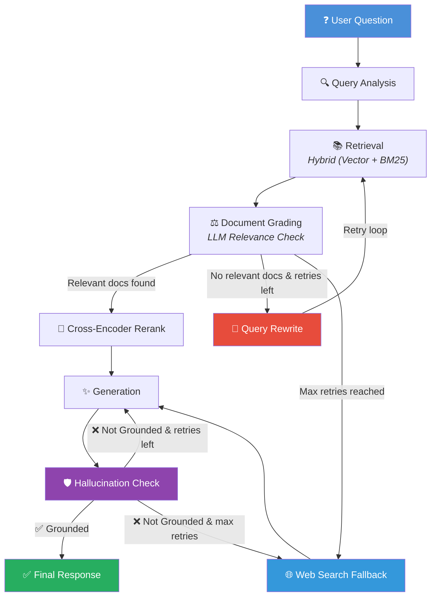

# Self-Corrective RAG Documentation Assistant
### Express Analytics AI/ML Engineer Intern Take-Home Assignment Submission

A production-grade, self-correcting Retrieval-Augmented Generation (RAG) assistant built using **FastAPI**, **LangGraph**, **ChromaDB**, and **Gemini/Groq LLMs**. Designed to answer complex technical questions over document corpora with zero hallucinations.

---

### 🌐 Live Deployment
This application is fully containerized and deployed on **Hugging Face Spaces**!
- **Live Streamlit App:** [RAG Documentation Assistant on Hugging Face Spaces](https://huggingface.co/spaces/aimprabu/RAG_Documentation_Assistant)

---

## 🧞 Project Overview

### What Problem This Solves
Technical documentation is dense, constantly updated, and contains complex relationships (API endpoints, parameters, configuration blocks). Standard LLMs lack this local context and frequently hallucinate answers. Traditional RAG systems retrieve documents but do not evaluate their relevance, leading to noisy contexts and incorrect generations. 

This project solves this by wrapping document retrieval in a **self-correcting agentic loop** that analyzes queries, grades retrieval relevance, rewrites queries dynamically, falls back to web search if the corpus lacks answers, and verifies that responses are grounded in the retrieved facts to prevent hallucinations.

### Why RAG Was Chosen
Fine-tuning an LLM on proprietary codebases is computationally expensive, requires continuous training as documentation updates, and does not support precise document citations. RAG separates the model's reasoning capabilities from its knowledge base, allowing real-time index updates and auditability via direct source citations.

### Why LangGraph Was Chosen
Standard LangChain Expression Language (LCEL) pipelines are directed acyclic graphs (DAGs). They cannot easily express iterative operations or cycles. Our self-correcting RAG architecture requires retry loops: if document grading finds all chunks irrelevant, the query is rewritten and retrieval is re-executed. LangGraph's StateGraph provides native support for cycles, state management, and routing decisions.

---

## 🏗️ Architecture



### System Components

| Component | Technology | Purpose |
|---|---|---|
| **API Layer** | FastAPI | High-performance REST API endpoints, schema validation, and logging |
| **Workflow Engine** | LangGraph StateGraph | Orchestrates agentic loops and conditional routing |
| **Vector Store** | ChromaDB | Persistent vector storage, metadata filtering, and semantic search |
| **Keyword Search** | rank_bm25 | Python BM25 implementation for lexical candidate matching |
| **Reranker** | sentence-transformers | MS-MARCO Cross-Encoder model for query-document re-ranking |
| **Embeddings** | all-MiniLM-L6-v2 | Local embedding model (384-dimensional dense vectors) |
| **Relational DB** | SQLite | Session chat history, document catalog registry, and user feedback |
| **UI Panel** | Streamlit | Dark-themed user dashboard, auto-uploader, and debug panel |

---

## 🔄 LangGraph Workflow

The StateGraph coordinates data flow through the following nodes:

1. **Query Analysis:** Analyzes user query, classifies it (conversational, conceptual, coding), and extracts key search terms.
2. **Retrieval:** Performs hybrid retrieval (Vector search + BM25 keyword search) from ChromaDB.
3. **Document Grading:** LLM checks whether retrieved chunks are relevant to the query. Irrelevant chunks are discarded.
4. **Query Rewrite:** If zero relevant chunks are found, the LLM reformulates the query to optimize keyword matching.
5. **Web Search:** After exhausting database retries, queries the web via DuckDuckGo and formats pages as temporary chunks.
6. **Generation:** Synthesizes a detailed answer using only relevant document chunks.
7. **Hallucination Check:** Evaluates answer factuality. If the answer contains facts not present in the chunks, it is rejected and sent back to Generation.

---

## 📊 State Schema

The LangGraph workflow maintains state using the `RAGState` TypedDict:

* `question` (str): Original user question.
* `rewritten_query` (str): Rewritten search query for database lookup.
* `query_type` (str): Classified query intent (conversational, conceptual, coding).
* `retrieved_docs` (list[DocumentChunk]): Candidate chunks returned by retrieval.
* `relevant_docs` (list[DocumentChunk]): Chunks graded as relevant by the grader.
* `generation` (str): Answer synthesized by the generator node.
* `sources` (list[SourceReference]): Citations used in the answer.
* `retry_count` (int): Number of database retrieval rewrite attempts.
* `max_retries` (int): Maximum number of database retries allowed.
* `should_fallback` (bool): Flag indicating if web search fallback should be used.
* `hallucination_score` (float): Grounding score (0.0 to 1.0) of the response.
* `hallucination_check_passed` (bool): Grounding verification verdict.
* `regeneration_count` (int): Count of regeneration attempts following grounding failures.

---

## 📦 Document Ingestion Pipeline

Ingestion handles new files in four structured stages:

```
[File Upload] -> [File Loaders] -> [Header-Aware Chunker] -> [Local Embeddings] -> [ChromaDB + SQLite]
```

1. **Document Loading:** Custom loaders parse `.md`, `.pdf`, `.txt`, and `.html` files.
2. **Header-Aware Chunking:** Rewrites raw text into semantic units. Rather than slicing at arbitrary lengths (which breaks tables and code blocks), the chunker splits along Markdown headers (`#` to `######`) and horizontal rules (`---`). Parent header hierarchies are prepended to each sub-chunk to preserve context.
3. **Embedding Generation:** Dense 384-dimensional embeddings are generated locally using `sentence-transformers/all-MiniLM-L6-v2`.
4. **Vector Storage & Cataloging:** Embeddings and chunks are written to persistent ChromaDB storage. Metadata (filename, size, hash) is registered in SQLite to support duplicate checking via SHA-256.

---

## 🌐 API Documentation

### `POST /query`
- **Purpose:** Submit user questions to the self-correcting RAG workflow.
- **Request Body:**
  ```json
  {
    "question": "What is FastAPI?",
    "session_id": "93665248-1234-5678-1234-567812345678",
    "top_k": 5,
    "max_retries": 2,
    "filter_filenames": ["fastapi_docs.md"]
  }
  ```
- **Response Example (200 OK):**
  ```json
  {
    "answer": "FastAPI is a modern web framework...",
    "sources": [
      {
        "source_file": "fastapi_docs.md",
        "document_id": "doc_9bdca13",
        "chunk_index": 2,
        "excerpt": "FastAPI is a modern, fast..."
      }
    ],
    "confidence_score": 0.95,
    "debug_trace": { ... }
  }
  ```

### `POST /ingest`
- **Purpose:** Ingest, chunk, embed, and index a file or web URL.
- **Request (Multipart Form):**
  - `file` (UploadFile, Optional): The local document file.
  - `url` (str, Optional): Remote HTML URL to scrap.
- **Response Example (201 Created):**
  ```json
  {
    "document_id": "doc_9bdca13",
    "filename": "fastapi_docs.md",
    "chunks_indexed": 23,
    "status": "indexed",
    "message": "Document successfully indexed."
  }
  ```

### `GET /documents`
- **Purpose:** Retrieve lists of all indexed documents in the database.
- **Response Example (200 OK):**
  ```json
  {
    "documents": [
      {
        "id": "doc_9bdca13",
        "filename": "fastapi_docs.md",
        "chunk_count": 23,
        "status": "indexed"
      }
    ]
  }
  ```

### `DELETE /documents/{id}`
- **Purpose:** Permanently remove document vectors and metadata.
- **Response Example (200 OK):**
  ```json
  {
    "message": "Successfully deleted document doc_9bdca13 and 23 chunks."
  }
  ```

### `POST /feedback`
- **Purpose:** Log thumbs-up or thumbs-down answer reviews.
- **Request:**
  ```json
  {
    "question": "What is FastAPI?",
    "answer": "FastAPI is a...",
    "feedback_type": "positive"
  }
  ```

### `GET /health`
- **Purpose:** Standard health check.
- **Response:** `{"status": "healthy", ...}`

### `GET /metrics`
- **Purpose:** Exposes statistics for dashboard logs.

---

## ✨ Bonus Features Implemented

* **✅ Hallucination Detection:** Generates responses, grades their grounding value against source chunks, and automatically triggers query rewrites or answer regenerations in case of hallucination.
* **✅ Web Search Fallback:** Falls back to DuckDuckGo/Tavily search when local vector retrieval fails to find relevant information.
* **✅ Conversation Memory:** Maintains multi-turn conversation logs in SQLite. Subsequent prompts are augmented with chat contexts to resolve pronouns and follow-ups.
* **✅ Streamlit UI:** Includes a premium dark-themed interface, drag-and-drop document uploaders, dynamic checklist indicators, collapsible source expanders, and complete debugging traces.

---

## ⚙️ Technical Decisions

1. **Why LangGraph:** cyclic workflows cannot be expressed in standard LangChain LCEL. LangGraph StateGraph handles loops natively.
2. **Why ChromaDB:** Lightweight, zero-config persistent vector database embedded directly inside Python, backed by SQLite.
3. **Why SQLite:** Zero dependency relational engine for logging chat context and user thumb feedback.
4. **Why Local Embeddings:** Local `sentence-transformers/all-MiniLM-L6-v2` is free, fast (~5ms), and offline-capable.
5. **Why Gemini + Groq Fallback:** Gemini serves as a powerful primary model. In the case of API timeouts or rate limits, the system automatically falls back to Groq (Llama-3.3-70B).

---

## ⚖️ Tradeoffs & Future Improvements

### Tradeoffs
- **Local Embedding Vector Size:** The `all-MiniLM-L6-v2` uses 384 dimensions. This is faster and requires less disk space, but has slightly lower semantic precision compared to OpenAI's 1536-dimensional embeddings.
- **SQLite Concurrency:** SQLite does not support high concurrent write loads. If scaled to multi-tenant production, SQLite should be replaced with PostgreSQL.

### Future Improvements
1. **Multi-Collection Support:** Allow segregation of documents into separate collections.
2. **Ollama Integration:** Support fully offline execution by replacing Gemini/Groq API calls with local Ollama models (e.g. Llama-3-8B).
3. **Streaming Responses:** Support Server-Sent Events (SSE) to stream answer tokens token-by-token.

---

## 📸 Interface Preview

### Landing Page
Empty-state central card containing document drag-and-drop zones and suggestions cards.

### Upload Flow
Auto-uploader shows a real-time checklist: `[✓] File uploaded`, `[✓] N chunks indexed`, and `[✓] Ready to query`.

### Chat Interface
Bot bubbles accompanied by source expanders that reveal 300-character context snippets when clicked.

### Debug Panel
Surfaces query categories, grounding scores, and chunk retrieval lists with exact ChromaDB cosine distances.

---

## 🛠️ How To Run

### Setup Environment
```bash
python -m venv venv
source venv/bin/activate  # venv\Scripts\activate on Windows
pip install -r requirements.txt
```

### Start Backend
```bash
uvicorn app.main:app --host 127.0.0.1 --port 8000 --reload
```

### Start Streamlit Frontend
```bash
streamlit run streamlit_app.py
```

### Run Automated Tests
```bash
venv/Scripts/python -m pytest
```

---

## ❓ Example Questions

1. *"What is FastAPI and what are its main features?"*
2. *"How do I initialize a persistent ChromaDB client in Python?"*
3. *"Explain the routing logic of a LangGraph StateGraph workflow."*
4. *"What is the parameter schema for POST /query?"*
5. *"How does reciprocal rank fusion (RRF) merge vector and keyword scores?"*
6. *"What is the purpose of the MS-MARCO Cross-Encoder reranker?"*
7. *"How do I delete a document from the vector store?"*
8. *"What is Anthropic's Model Context Protocol (MCP)?"* (Triggers web fallback)
9. *"Who won the last soccer world cup?"* (Triggers web fallback)
10. *"How do I define Pydantic models for request validation?"*

---

## 📂 Submission Documentation

For a detailed review of all components, reference the following generated take-home documents:

| Document | Purpose |
|---|---|
| **[REVIEWER_GUIDE.md](REVIEWER_GUIDE.md)** | 5-minute step-by-step reviewer verification guide. |
| **[SUBMISSION_SUMMARY.md](SUBMISSION_SUMMARY.md)** | Architecture details, decisions, challenges solved, and production qualities. |
| **[REQUIREMENTS_MAPPING.md](REQUIREMENTS_MAPPING.md)** | Explicit compliance mapping showing where each assignment requirement is implemented. |
| **[SYSTEM_DESIGN.md](SYSTEM_DESIGN.md)** | Full software system component architecture. |
| **[DATABASE_DESIGN.md](DATABASE_DESIGN.md)** | ChromaDB vector and SQLite relational schema definitions. |
| **[API_SPECIFICATION.md](API_SPECIFICATION.md)** | REST API controllers, schemas, and endpoint request-response payloads. |

---
## License
MIT
