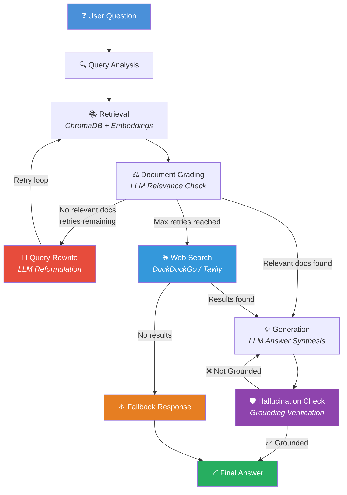

# RAG Assistant: Technical Documentation Copilot

A self-correcting Retrieval-Augmented Generation (RAG) assistant built using **FastAPI**, **LangGraph**, **ChromaDB**, and the **Gemini / Groq LLM API**.

This project implements an intelligent technical assistant that can reliably answer questions over a set of ingested markdown documentation. It features an advanced self-evaluating workflow that checks document relevance, prevents hallucinations, performs web search fallback, and gracefully falls back when no relevant information is found.

## Architecture

### LangGraph Workflow

The core of this system is a **self-corrective agentic loop** built on LangGraph's `StateGraph`. Each node performs a specific reasoning step, with conditional edges enabling automatic retry and self-healing:



### System Components

| Component | Technology | Purpose |
|---|---|---|
| **API Layer** | FastAPI | REST endpoints, validation, error handling |
| **Workflow Engine** | LangGraph StateGraph | Agentic node orchestration with conditional routing |
| **Vector Store** | ChromaDB | Persistent semantic search over document chunks |
| **Embeddings** | sentence-transformers/all-MiniLM-L6-v2 | Local embedding generation (no API dependency) |
| **LLM Provider** | Google Gemini / Groq | Query analysis, grading, generation, hallucination check |
| **Database** | SQLite | Document registry, feedback storage, conversation memory |
| **UI** | Streamlit | Interactive demo with retrieval debug panel |

### Key Design Decisions

1. **Local Embeddings**: Uses `all-MiniLM-L6-v2` locally instead of API-based embeddings. Zero cost, zero latency variance, works offline.
2. **Lazy LLM Initialization**: LLM client is initialized once at startup and shared across requests via dependency injection singletons.
3. **Self-Corrective Loop**: When document grading finds all chunks irrelevant, the query is automatically rewritten and re-retrieved up to `MAX_RETRIES` times before falling back to web search.
4. **Web Search Fallback**: After exhausting retries, the system queries DuckDuckGo (or Tavily) and converts web results into document chunks for answer synthesis.
5. **Hallucination Guard**: Post-generation grounding verification ensures the answer is strictly supported by retrieved context.
5. **Duplicate Detection**: Document ingestion uses SHA-256 content hashing to prevent re-indexing identical files.

## Features

- **Document Ingestion Pipeline:** 
  - Loads local markdown, PDF, and text documents
  - Generates embeddings locally using `sentence-transformers/all-MiniLM-L6-v2`
  - Persists vector data to ChromaDB with metadata
  - Maintains document registry in SQLite with duplicate detection
- **Agentic Workflow (LangGraph):**
  - **Query Analysis**: Interprets and classifies user intent
  - **Retrieval**: Fetches relevant chunks from ChromaDB
  - **Document Grading**: LLM evaluates chunk relevance, triggers query rewrite if needed
  - **Generation**: Synthesizes a factual, grounded answer
   - **Hallucination Check**: Verifies the answer is strictly supported by retrieved context
   - **Web Search Fallback**: When all retries are exhausted, searches the web via DuckDuckGo/Tavily
- **Conversation Memory:**
  - Session-based chat history stored in SQLite
  - Follow-up questions inherit conversation context
- **Interactive Streamlit UI:**
  - Document upload and corpus browser
  - Chat interface with streaming responses
  - **Retrieval Debug Panel** showing full LangGraph execution trace
  - Inline feedback submission
- **REST API:**
  - `POST /query` — Ask questions with full debug trace
  - `POST /ingest` — Upload and index documents
  - `GET /documents` — Browse indexed corpus
  - `POST /feedback` — Submit answer ratings
  - `GET /metrics` — System statistics dashboard
  - `GET /health` — Service health check
- **Production-Ready:**
  - Automated CI/CD pipeline via GitHub Actions
  - Containerized deployment with Docker and Docker Compose
  - \>80% test coverage using Pytest

## Getting Started

### Prerequisites
- Python 3.11+
- [Docker](https://www.docker.com/) (Optional for container deployment)
- A valid Google Gemini API Key

### Installation

1. **Clone and setup environment:**
   ```bash
   git clone https://github.com/your-repo/rag-assistant.git
   cd rag-assistant
   python -m venv venv
   source venv/bin/activate  # Or `venv\Scripts\activate` on Windows
   pip install -r requirements.txt
   ```

2. **Configure Environment:**
   Create a `.env` file in the root directory:
   ```ini
   LLM_PROVIDER=google
   LLM_MODEL=gemini-2.5-flash
   GEMINI_API_KEY=your_api_key_here
   CHROMA_PERSIST_DIR=./chroma_db
    SQLITE_DB_PATH=./data/app.db

    # Optional: Web search fallback
    WEB_SEARCH_ENABLED=true
    WEB_SEARCH_PROVIDER=duckduckgo  # or "tavily"
    TAVILY_API_KEY=your_tavily_key_here
    ```

3. **Ingest Documents:**
   ```bash
   python -m ingestion.ingest_corpus
   ```

4. **Run the API Server:**
   ```bash
   uvicorn app.main:app --reload --host 127.0.0.1 --port 8000
   ```

5. **Launch the Streamlit UI:**
   ```bash
   streamlit run streamlit_app.py
   ```
   Open http://localhost:8501 in your browser.

### Docker Deployment

```bash
docker-compose up --build
```
- API: http://localhost:8000
- Swagger Docs: http://localhost:8000/docs

### Testing

```bash
# Run full test suite with coverage
python -m pytest --cov=app tests/

# Smoke tests against running server
python scripts/smoke_test.py
```

## Project Structure

```
RAG/
├── app/
│   ├── api/
│   │   ├── routes/          # FastAPI endpoint handlers
│   │   └── schemas/         # Pydantic request/response models
│   ├── core/                # Logging, database, exceptions, middleware
│   ├── infrastructure/      # Adapters: LLM, embeddings, vector store, doc loaders, web search
│   ├── repositories/        # SQLite data access layer
│   ├── services/            # Business logic orchestration
│   ├── utils/               # Chunking, hashing utilities
│   └── workflow/            # LangGraph nodes, routing, state, prompts
├── corpus/                  # Source documents for ingestion
├── tests/                   # Unit, integration, and API tests
├── scripts/                 # Operational utilities
├── streamlit_app.py         # Interactive Streamlit UI
├── Dockerfile               # Container build
├── docker-compose.yml       # Container orchestration
└── requirements.txt         # Python dependencies
```

## Documentation

| Document | Description |
|---|---|
| [PROJECT_PRD.md](PROJECT_PRD.md) | Product Requirements Document |
| [TECHNICAL_ARCHITECTURE.md](TECHNICAL_ARCHITECTURE.md) | Technical decisions and system context |
| [SYSTEM_DESIGN.md](SYSTEM_DESIGN.md) | Component design and data flow |
| [LANGGRAPH_DESIGN.md](LANGGRAPH_DESIGN.md) | Agentic workflow routing logic |
| [AI_ENGINEERING.md](AI_ENGINEERING.md) | Chunking strategy and LLM configuration |
| [DATABASE_DESIGN.md](DATABASE_DESIGN.md) | Schema design and indexing strategy |
| [API_SPECIFICATION.md](API_SPECIFICATION.md) | REST API endpoint specification |
| [TESTING_STRATEGY.md](TESTING_STRATEGY.md) | Test coverage plan and methodology |

## License
MIT
