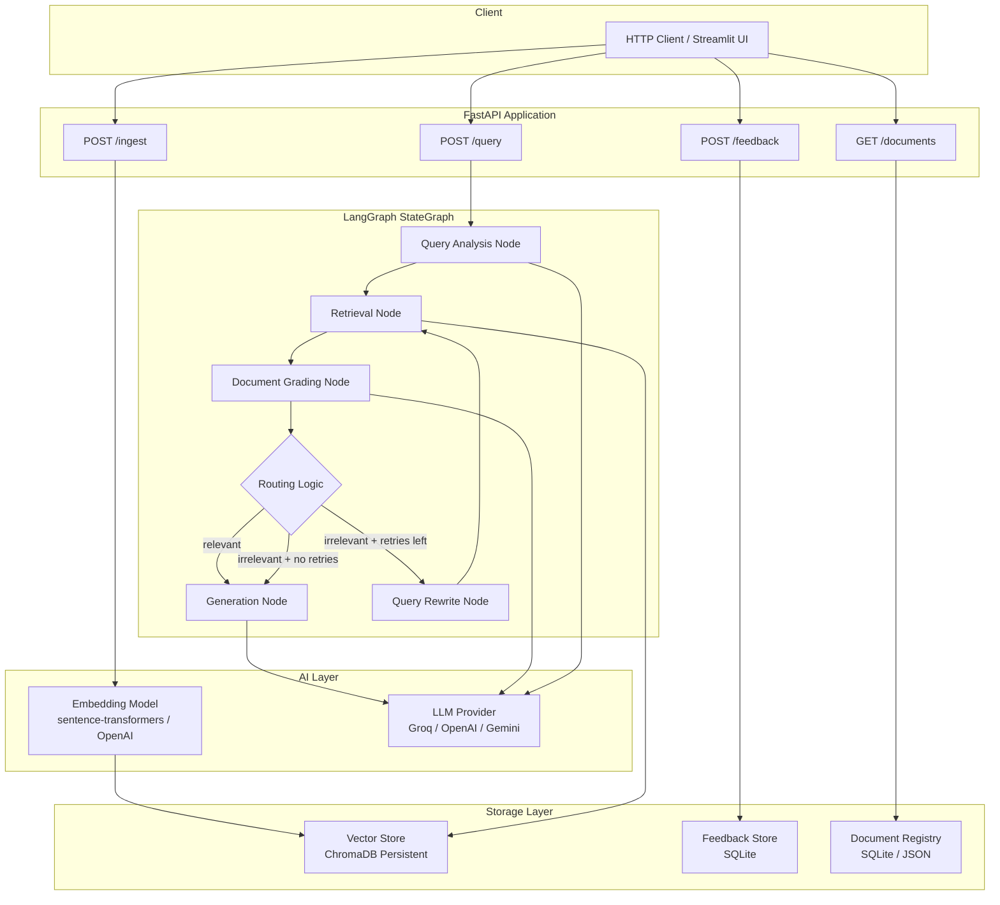
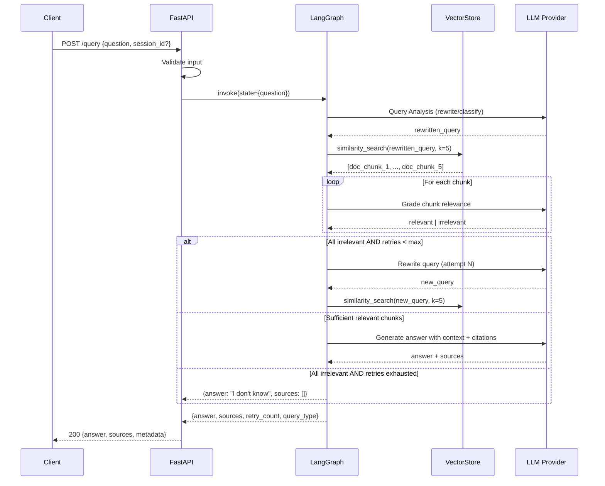
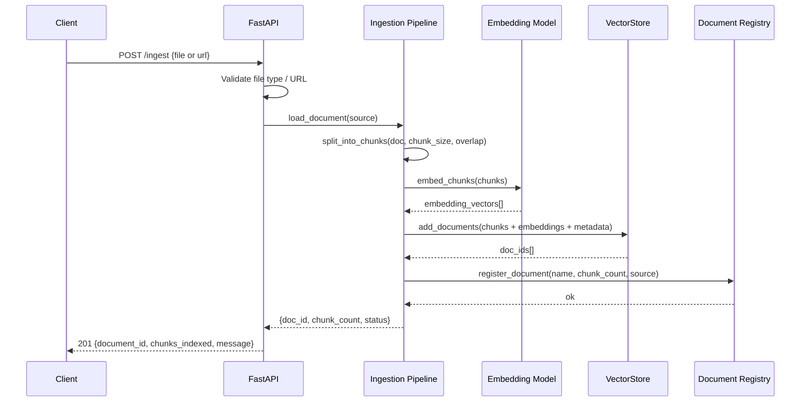
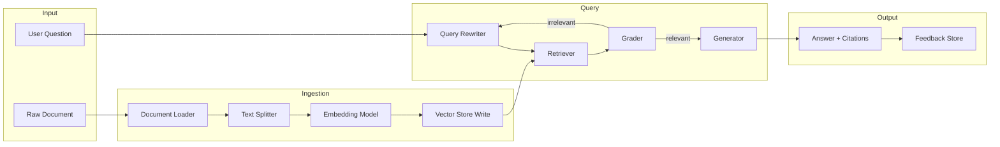
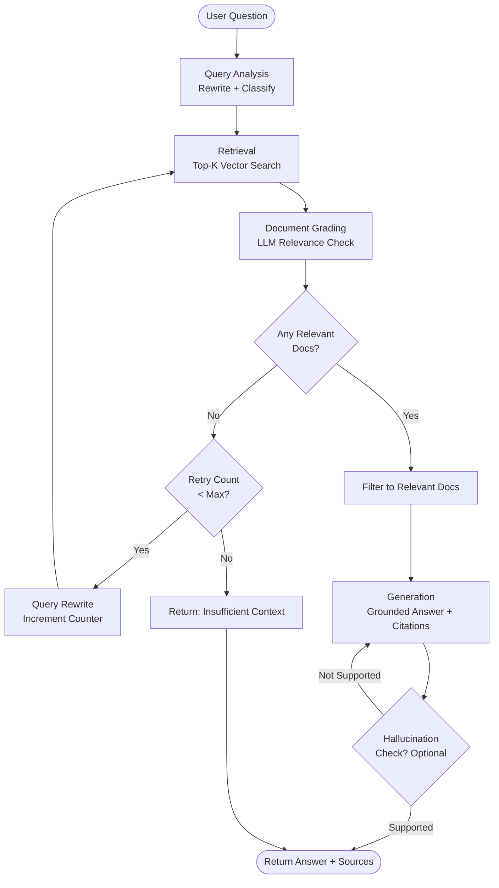
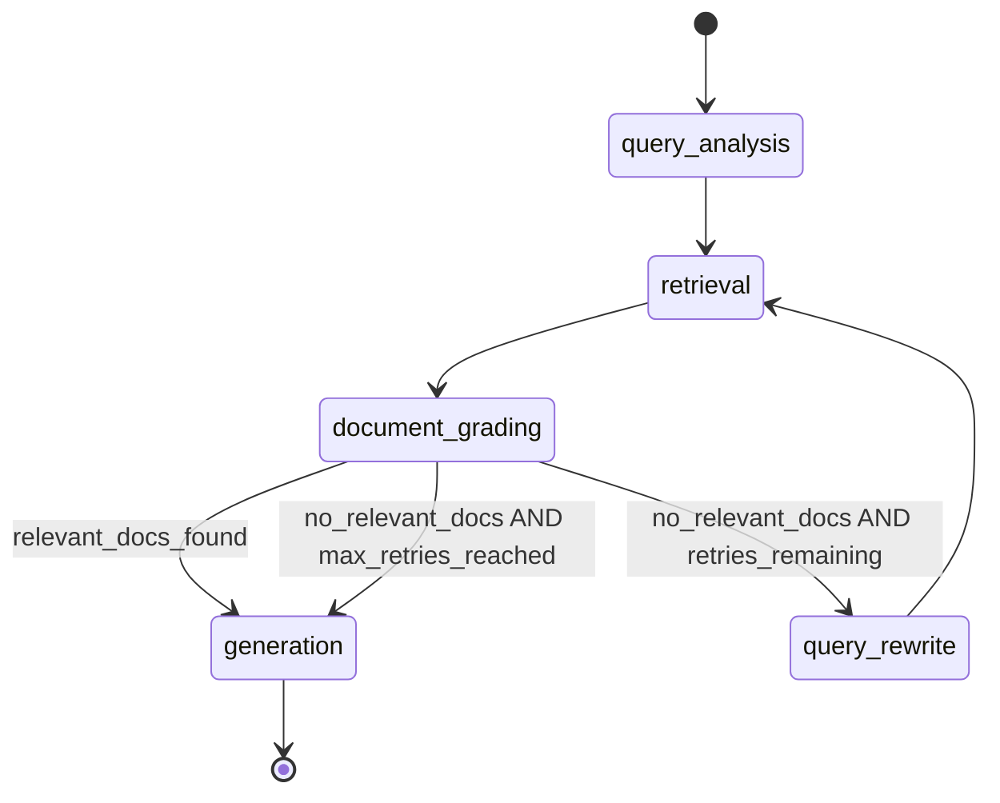

# SYSTEM_DESIGN.md — System Design Document
## RAG-Based Technical Documentation Assistant

**Version:** 1.0.0
**Date:** 2025-06-11

---

## High Level Architecture

The system is composed of four major layers:

1. **API Layer** — FastAPI application exposing REST endpoints
2. **Orchestration Layer** — LangGraph StateGraph managing the RAG workflow
3. **AI Layer** — LLM provider (for grading + generation) and embedding model
4. **Storage Layer** — Vector store (ChromaDB) + feedback store (SQLite)

```
┌─────────────────────────────────────────────────────────┐
│                    Client (HTTP)                         │
└─────────────────────────┬───────────────────────────────┘
                          │
┌─────────────────────────▼───────────────────────────────┐
│                   FastAPI Layer                          │
│  POST /query  │  POST /ingest  │  GET /docs  │ /feedback│
└─────────────────────────┬───────────────────────────────┘
                          │
┌─────────────────────────▼───────────────────────────────┐
│              LangGraph Orchestration Layer               │
│  QueryAnalysis → Retrieval → Grading → Generation        │
│            (with conditional routing + retry)            │
└──────┬──────────────────┬──────────────────┬────────────┘
       │                  │                  │
┌──────▼──────┐   ┌───────▼──────┐  ┌───────▼──────────┐
│  Embedding  │   │  Vector Store│  │   LLM Provider   │
│  Model      │   │  (ChromaDB)  │  │ (Groq/OpenAI)    │
└─────────────┘   └──────────────┘  └──────────────────┘
                                             │
                                    ┌────────▼────────┐
                                    │  Feedback Store  │
                                    │    (SQLite)      │
                                    └─────────────────┘
```

---

## Component Diagram



---

## Request Flow

### Query Request Flow



### Ingestion Request Flow



---

## Data Flow



---

## RAG Pipeline Flow



---

## LangGraph Workflow



---

## State Management Strategy

The LangGraph workflow uses a `TypedDict`-based state schema passed between all nodes. Each node receives the full state and returns a partial update. The state is immutable between node transitions — nodes return dicts with only the keys they modify.

**Key state fields:**
- `question` — original user question (immutable)
- `rewritten_query` — current query being used for retrieval
- `query_type` — classification (conceptual / how-to / troubleshooting / api-reference)
- `retrieved_docs` — list of raw retrieved chunks
- `graded_docs` — list of (chunk, grade) tuples
- `relevant_docs` — filtered list of relevant chunks only
- `generation` — final answer string
- `sources` — list of source metadata objects
- `retry_count` — integer tracking rewrite retries
- `max_retries` — configurable maximum (default: 2)
- `should_fallback` — boolean flag set when retries exhausted

---

## Retrieval Architecture

- **Vector Store:** ChromaDB (persistent mode) or FAISS (file-serialized)
- **Similarity Metric:** Cosine similarity (default in ChromaDB)
- **Top-K:** Configurable, default `k=5`
- **Embedding Model:** `sentence-transformers/all-MiniLM-L6-v2` (local, free) or `text-embedding-3-small` (OpenAI)
- **Metadata stored per chunk:** `source_file`, `page_number` (if applicable), `chunk_index`, `document_id`, `ingestion_timestamp`
- **Namespace:** Single namespace for MVP; multi-namespace in future

---

## Document Grading Architecture

- Each retrieved chunk is passed independently to the LLM with the user question
- Prompt instructs LLM to output `{"grade": "relevant"}` or `{"grade": "irrelevant"}` as JSON
- Grades are collected and the pipeline routes based on aggregate result
- If ≥ 1 chunk is relevant, proceed to generation with filtered set
- If 0 chunks are relevant and retry count < max, trigger query rewrite
- If 0 chunks are relevant and retry count ≥ max, set `should_fallback = True`

**Grading Prompt Template:**

```
You are a relevance grader. Given a user question and a document chunk,
determine if the chunk contains information useful for answering the question.
Respond ONLY with JSON: {"grade": "relevant"} or {"grade": "irrelevant"}.

Question: {question}
Document chunk: {chunk}
```

---

## Query Rewrite Architecture

- Triggered when all documents are graded irrelevant
- LLM is prompted to produce an alternative phrasing of the query
- Rewritten query replaces `rewritten_query` in state
- `retry_count` is incremented
- Routing returns to Retrieval node

**Rewrite Prompt Template:**

```
The following question failed to retrieve relevant documents from a technical documentation corpus.
Rewrite it to be more specific, use different terminology, or expand with synonyms.
Return only the rewritten question as a plain string.

Original question: {question}
Failed query: {rewritten_query}
Attempt: {retry_count}
```

---

## Generation Architecture

- Context is assembled from `relevant_docs` (or all docs if fallback is not triggered)
- Each chunk is prefixed with its source identifier
- LLM is prompted to answer grounded in context only
- Citations are formatted as `[Source: filename, chunk N]` inline
- If `should_fallback = True`, a fixed "insufficient context" message is returned without LLM call

**Generation Prompt Template:**

```
You are a technical documentation assistant. Answer the user's question based ONLY on the
provided context. If the context does not contain sufficient information, say so clearly.
Include citations in the format [Source: <filename>] after each claim.

Context:
{context}

Question: {question}

Answer:
```

---

## Retry Architecture

```
retry_count: int = 0
max_retries: int = 2  # configurable via env

def should_retry(state) -> str:
    if len(state["relevant_docs"]) > 0:
        return "generate"
    if state["retry_count"] < state["max_retries"]:
        return "rewrite"
    return "fallback"
```

The routing function is a pure function of the state, making it deterministic and testable.

---

## Failure Handling

| Failure Mode | Handling Strategy |
|---|---|
| LLM API timeout | Retry with exponential backoff (max 3 attempts) |
| LLM API rate limit | 429 caught, wait + retry |
| LLM returns malformed JSON (grading) | Default to "irrelevant" on parse error |
| Vector store unavailable on startup | Fail fast with clear error message |
| Empty retrieval results (k=0) | Treat as all-irrelevant, trigger retry flow |
| File upload fails validation | Return 400 with specific error message |
| Max retries exhausted | Return structured fallback response, not 500 |
| Embedding model unavailable | Fail fast during startup health check |

---

## Scalability Considerations

> **Note:** The following are design-level considerations. MVP does not implement all of these.

| Concern | Current Approach | Future Scale Approach |
|---------|-----------------|----------------------|
| Vector store | ChromaDB local | Pinecone / Weaviate managed |
| LLM concurrency | Sequential node execution | Async LangGraph + async LLM calls |
| Ingestion throughput | Synchronous, per-request | Background task queue (Celery / ARQ) |
| State persistence | In-memory per request | Redis-backed checkpointer |
| API scaling | Single uvicorn process | Multiple workers + load balancer |
| Corpus size | 3-5 docs, hundreds of chunks | Millions of chunks with ANN indexing |

---

## Security Architecture

- All LLM API keys stored in `.env` file, loaded via `python-dotenv`
- `.env` is git-ignored; `.env.example` is committed with placeholder values
- File upload validation: extension whitelist (.md, .txt, .html, .pdf), size limit (10MB)
- Input sanitization: query string max length enforced (2000 chars)
- Prompt injection mitigation: user input never directly injected into system prompt; always placed in designated `{question}` slot
- CORS configured restrictively for local development
- No PII collected or stored; feedback is anonymous

---

## Performance Considerations

| Optimization | Implementation |
|---|---|
| Embedding cache | Cache embeddings by document hash to avoid re-embedding unchanged content |
| Batch grading | Grade multiple chunks in a single LLM call where model supports it |
| Async FastAPI routes | Use `async def` for all route handlers |
| Lazy vector store init | Initialize ChromaDB once at startup, reuse connection |
| Streaming responses | Optional: stream generation output for lower perceived latency |
| Chunk size tuning | 512 tokens with 64-token overlap balances context and precision |

---

## Deployment Architecture

### Local Development

```
uvicorn app.main:app --reload --host 0.0.0.0 --port 8000
```

### Docker

```dockerfile
FROM python:3.11-slim
WORKDIR /app
COPY requirements.txt .
RUN pip install -r requirements.txt
COPY . .
CMD ["uvicorn", "app.main:app", "--host", "0.0.0.0", "--port", "8000"]
```

### Render / Railway

```yaml
# render.yaml
services:
  - type: web
    name: rag-assistant
    env: python
    buildCommand: pip install -r requirements.txt
    startCommand: uvicorn app.main:app --host 0.0.0.0 --port $PORT
```

### Environment Variable Requirements

```
OPENAI_API_KEY=...        # or GROQ_API_KEY / GOOGLE_API_KEY
EMBEDDING_MODEL=sentence-transformers/all-MiniLM-L6-v2
LLM_PROVIDER=groq
LLM_MODEL=llama3-8b-8192
CHROMA_PERSIST_DIR=./chroma_db
MAX_RETRIES=2
TOP_K=5
CHUNK_SIZE=512
CHUNK_OVERLAP=64
```